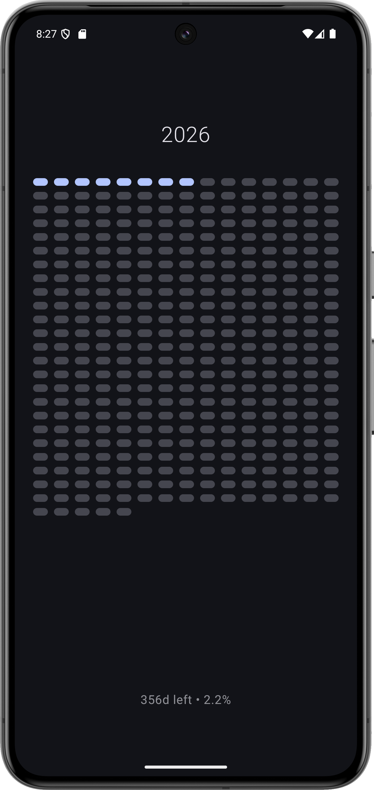
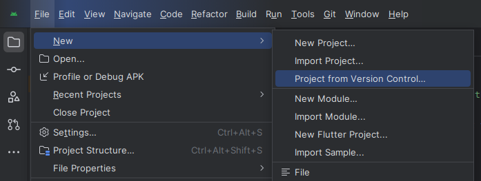

# dots-calendar

> "One year is a lot shorter than you think, don't waste it"

A minimalist Android app that visualizes your year progress through dots. Each dot represents a day of the year, helping you stay mindful of how you spend your time.

## Features
- Shows the current year
- Dot grid where filled dots = days completed
- Displays days left and % complete
- Built with Jetpack Compose + Material 3

## Screenshots


## Setup

1. Clone the repository
    ```bash
    git clone https://github.com/yourusername/dots-calendar.git
    ```
   Or copy the URL and then in android studio paste the link and click clone. 
   

2. Open the project in Android Studio

3. Build and run on your device or emulator

## Requirements

- Android Studio Hedgehog or later
- Minimum SDK: 26 (Android 8.0)
- Target SDK: 34

## Acknowledgments

Inspired by the need to make every day count and visualize the passage of time in a meaningful way. :)